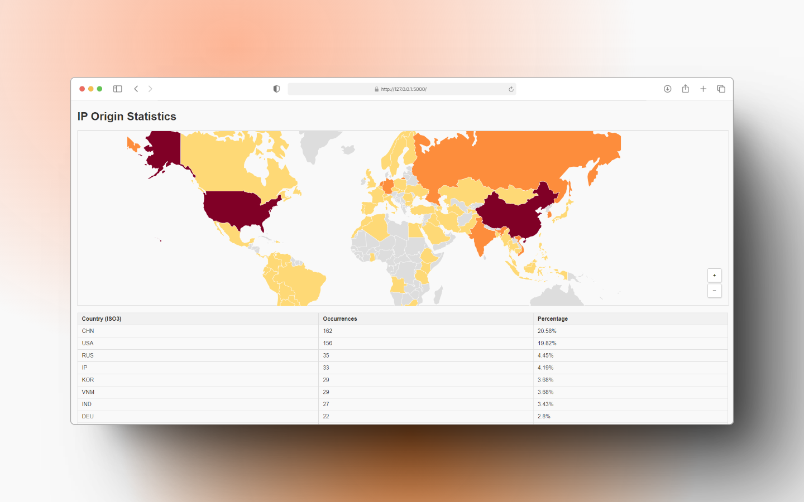

# Banned Countries Map

A Flask-based web application that visualizes the geographic origins of banned IP addresses on an interactive world map. The app extracts flagged IPs taken from fail2ban’s sshd jail via UFW status and uses the system’s `geoiplookup` (from geoip-bin) along with the Python package `pycountry` to determine and display the corresponding country.



> [!IMPORTANT]  
> This project has been tested only on Python 3.10.12 and Ubuntu 22.04.5 LTS.  

## Features

- Displays an interactive world map with color-coded markers based on the number of banned IPs per country.
- Presents a table listing each country (in ISO3 format), the occurrence count of banned IPs, and its percentage of the total.
- Includes zoom in/out controls for the map.

## Prerequisites

Before running the app on Ubuntu 22.04 (or similar), ensure you have:

- Python 3.10.12 (or greater if you want to try out your luck)
- UFW enabled and configured to log and reject unwanted connections.
- **geoip-bin** installed for `geoiplookup` to work. For Ubuntu, install it via apt:
  
  ```bash
  $ sudo apt install geoip-bin
  ```

> [!WARNING]  
> The application calls `sudo ufw status` within the code. You need to run the application with a user that has sufficient privileges.

## Installation

1. **Clone the repository:**

   ```bash
   $ git clone https://github.com/joonanykanen/banned-countries-map.git
   ```

2. **Change into the project directory:**

   ```bash
   $ cd banned-countries-map
   ```

3. **Create a Python virtual environment:**

   ```bash
   $ python3 -m venv venv
   source venv/bin/activate
   ```

4. **Install the rest dependencies:**

   ```bash
   $ pip install -r requirements.txt
   ```

## Running the Application

1. **Ensure geoip-bin is installed**  
   You can test this by running:
   >$ which geoiplookup

    And it should return the full path to geoiplookup. E.g.:

   > /usr/bin/geoiplookup  

2. **Start the Flask app:**

   ```
   python app.py
   ```

3. **Enter your sudo password when prompted:**  
   When the application initializes, it may ask for `sudo` privileges to run `ufw status`. This might look like:

   (venv) joona@test-instance:~/banned-countries-map$ python app.py  
   * Serving Flask app 'app'  
   * Debug mode: on  
   WARNING: This is a development server. Do not use it in a production deployment.  
   * Running on http://127.0.0.1:5000  
   Press CTRL+C to quit  
   * Restarting with stat  
   * Debugger is active!  
   * Debugger PIN: 800-638-335  
   [sudo] password for joona:  

   Simply type your password and hit Enter to continue.

4. **Open your web browser** and navigate to:  
   [http://127.0.0.1:5000](http://127.0.0.1:5000)

Hurray! You should see the Web UI with an interactive map and a table of banned IP statistics.


## Notes & Tips

- The JavaScript libraries (D3, TopoJSON, Datamaps) used for the front-end view are loaded via CDN. It is possible that there comes a day these will get deprecated and removed.
- You can adjust the zoom thresholds in the JavaScript code if needed to better represent your data. E.g. from `d3.behavior.zoom().scaleExtent([0.5, 8])` to `d3.behavior.zoom().scaleExtent([0.25, 20])`.

> [!TIP]
> If you don't get any IPs, be sure to check that the banned IPs are labeled as "REJECT" when running `fail2ban-client status`. If they are something else, you can modify `app.py` accordingly. Otherwise, be happy since there are allegedly no diligent intruders trying to get into your system!

## License

This project is licensed under the [MIT License](LICENSE).